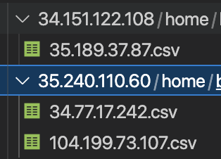

# CSBench Cloud Service Benchmark project.
# SUT:
 # MongoDB
# Reaseach Question
 # How does the number of secondary replicas in a primary copy deployment influence data consistency in MongoDB?

# Requirements

* Python 3.x 
* Ansible 2.x
* Mongosh 1.6.x
* Mo - Mustache Templates in Bash
* Node.js 14.x
* gcloud cli

----

# Benchmark

## Setup

1. Login into `gcloud`, select the project where the benchmark shall be executed.
2. Now you will procced to create the necessary instances in gcloud to execute the benchmark.
3. Clone the repository `https://github.com/klinkert0728/CSBench.git`
4. Navigate to the project `cd CSBench`
5. Execute the following command. `./create-gcp-instances.sh exp_number replicas benchmark_clients`.
e.g `./create-gcp-instances.sh 1 2 6`

    This command will create the necesary instances to run the benchmark, configure the firewall rule to allow mongo to accept `INGRESS` connections and using ansible, this will:
    1. Use `Mo` to create the `hosts.yml` based on the `ansible/host_template.yml`. by executing `configureHostFile.sh` and using the ips of the instances generated.
    2. Copy the basic configuration to run mongo in a replica set deployment. See config here: `ansible/mongod.conf`.
    3. Download and install MongoDB in the replicas and in the primary copy.
    4. Copy the replica set configuration and initialize it. See config here `mongosh/members_config.js`
    5. Configure the two types of benchmark clients.
        1. Reading client: Responsible to read the number of products on each replica instance and create the raw data as a csv file, using `python`. 
        2. Writing client simulate a web application in `node.js` that will write to the primary copy the products.

The execution of the previews steps will take ~ 15 min :coffee:

## Execution

After the script above finished, the setup phase will be done. Now you will need to run the benchmark clients to start the benchmark experiment.
1. Run the following command `ansible-playbook -i clients_hosts.yml -f 30 ansible/start_bench_clients.yml --ssh-common-args='-o StrictHostKeyChecking=no'` to start the benchmark clients.
    1. First, the reading clients will be started. Each selected region (Europe and Australia) will have one dedicated machine, for each replica (defined in the [Setup phrase 5.](#setup) second parameter) a docker container will be created, to run the python script to query the number of products of each replica.
        ```ansible
        docker run -d --name primary_copy reading-client-eu "{{  hostvars[groups.reading_clients[0]].primary_copy }}" "primary"
        docker run -d --name "{{ item.key }}"-"{{ item.value }}" reading-client-eu "{{ item.value }}" "secondary"
        ```
        The parameter `primary` or `secondary`, determines the reading preference for mongo `https://www.mongodb.com/docs/manual/core/read-preference/` and the `{{item.value}}` the ip of the target for the client
    
    2. Then the writing clients will spawn `7` node procceses per each instance that was created for the benchmark clients, e.g you ran the example command `./create-gcp-instances.sh 1 2 6`. This means the benchmark experiment will be `1` with `2` secondary copies and `6` writing benchmark vm instances. Therefore, in total you will create `42` writing clients. This is the number of clients required to stress the system enough to be able to have meaningful results.
        ```ansible
            - name: Start first writing client to primary
                ansible.builtin.shell: cd ./CSBench/writingClient && pm2 start -f app.js -- "{{  hostvars[groups.writing_clients[0]].primary_copy }}"
              loop:
                - 1
                - 2
                - 3
                - 4
                - 5
                - 6
                - 7
        ```
        The writing client takes only one input parameter, the `primary_copy` url, which is defined in the inventory file.

## Collecting results

After starting the benchmark, At any point in time one can collect the results from each replica and the primary by executing the following command.
`ansible-playbook -i clients_hosts.yml -f 30 ansible/collect_reading_client_data.yml --ssh-common-args='-o StrictHostKeyChecking=no'`
This will create a folder inside `ansible`, this folder will containing the results created by the reading clients in a csv format.
<br>
<br>

<br>
<br>

The experiments were executed for 15 minutes, after the 15 min the command `ansible-playbook -i clients_hosts.yml -f 30 ansible/stop_writing_clients.yml --ssh-common-args='-o StrictHostKeyChecking=no'` was executed, afterwards 5 more minutes where given to ensure the vm reduce the load as expected.

The results folder contains three experements executed for the subject `Cloud Service Benchmarking`, with some basic graphics used to analize the data and create the report `https://www.overleaf.com/read/nmfqzgmmcskg`.